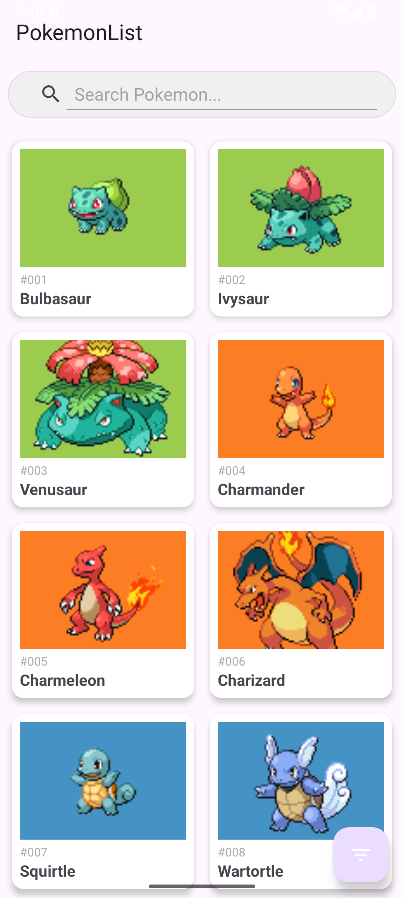
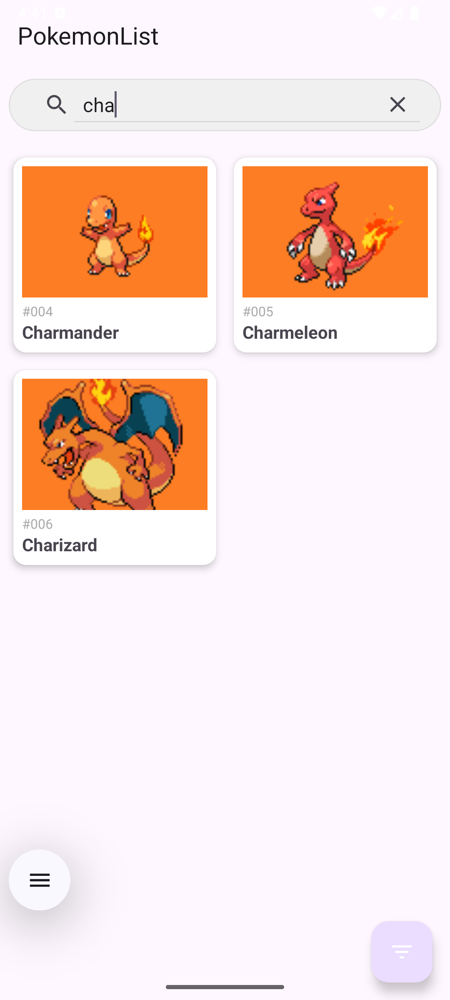
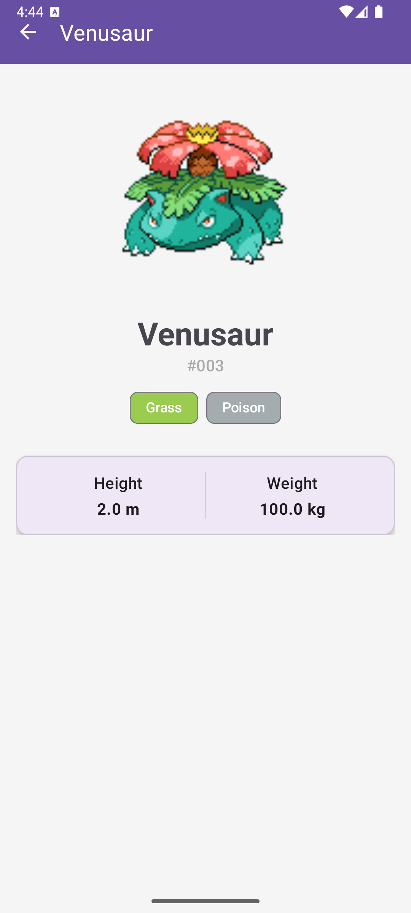
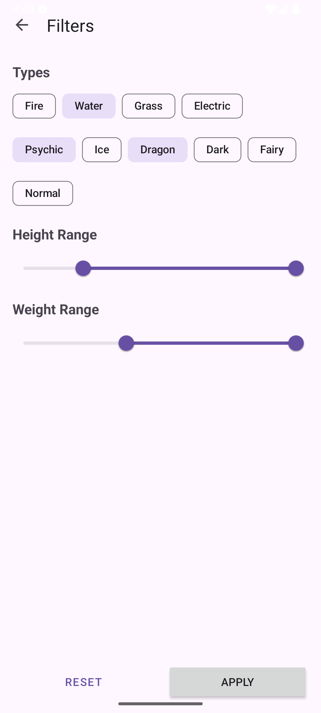

# Android-приложение для отображения списка Покемоном с возможностью фильтрации и поиска по названию
Приложение использует [PokeApi](https://pokeapi.co) для получения данных о Покемонов из таких экранов:  
1. Экран списка Покемонов, который поддерживает поиск по названию  
2. Экран детальной информации о Покемоне  
3. Экран фильтрации
Также поддержано кэширование списка и пагинация, приложение построено по принципам Clean Architecture.

## Стек технологий:
**Архитектура:** MVVM, Clean Architecture  
**Асинхронность:** Kotlin Flow, Coroutines  
**Сеть:** Retrofit, OkHttp  
**Хранение данных:** Room  
**DI:** Dagger Hilt  
**UI:** XML, ViewBinding, Navigation Component, Material Design  

## Демонстрация работы

  

## Скриншоты

  

  
  

## Автор
Алина Акимова  
Android-разработчик  
[GitHub](https://github.com/malinochkaaa)

